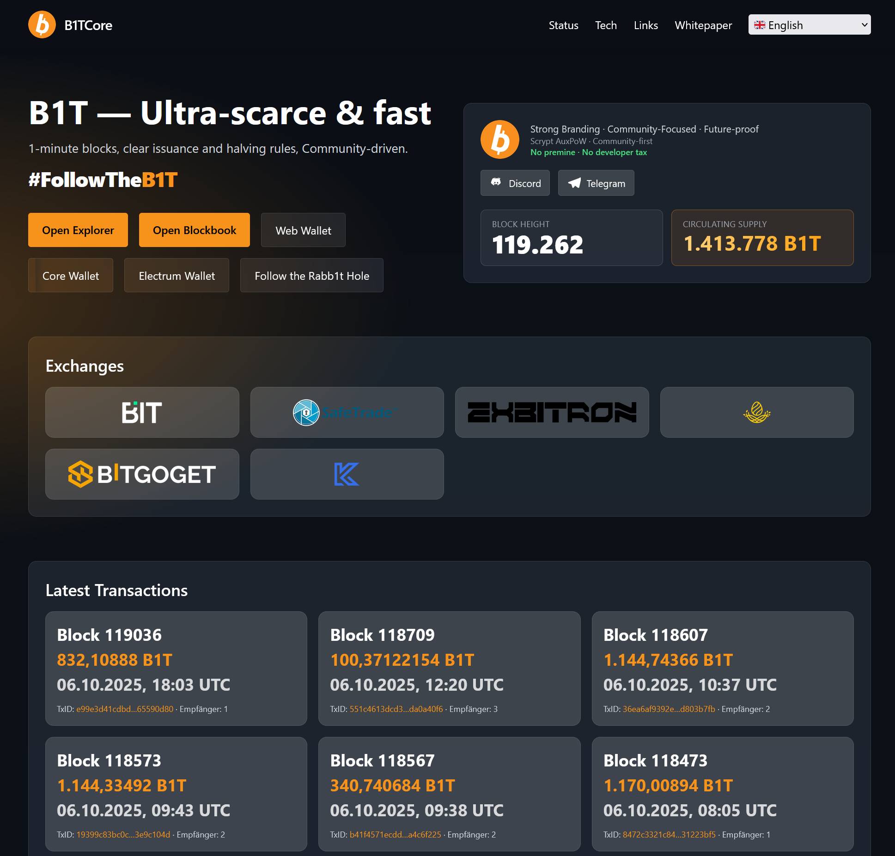

# B1tWeb v2 — BITCore / B1T website

This repository contains a lightweight, static website for the BITCore (B1T) project. It focuses on clarity, speed, and a community‑driven presentation. No backend is required; data is read from public APIs on the client side.

## Highlights
- Internationalization (i18n) with JSON language files
- Responsive, modern layout with a compact, informative footer
- Data loaded from public APIs
- Simple static hosting (GitHub Pages friendly)

## Quick Start
- Open `index.html` directly in your browser, or run a local static server:
  - Python: `python -m http.server 8000`
  - Then visit `http://localhost:8000/`
- Use the language selector in the top‑right to switch languages.

## Project Structure
- `index.html` — Main page
- `js/app.js` — App logic, i18n loader, UI hooks
- `i18n/*.json` — Translations (EN, DE, FR, ID, VI, ZH, SV, RU, PT, ES)
- `data/links.json` — Reference links (wallets, explorers, communities)
- `external/bitsite/` — Additional site assets (currently tracked as a submodule)

## Deploy (GitHub Pages)
1. Push to GitHub (`main` branch).
2. In the repository settings, enable GitHub Pages for the `main` branch and root directory.
3. Optionally configure a custom domain in GitHub Pages settings.

## Contributing
Issues and pull requests are welcome. For translations, update the relevant `i18n/*.json` file and ensure `js/app.js` includes the language code.

## Notes
- If you prefer not to use a Git submodule for `external/bitsite`, you can convert it to regular files.